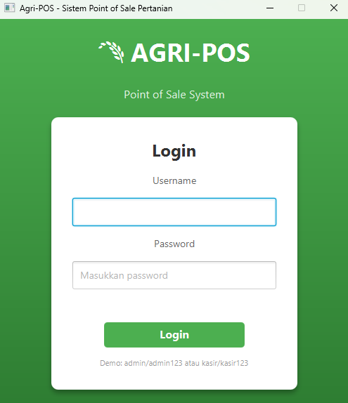

# Laporan Praktikum Week 15: Proyek Kelompok
## Agri-POS - Sistem Point of Sale Pertanian

### Informasi Praktikan
- **NIM**: [Masukkan NIM]
- **Nama**: [Masukkan Nama]
- **Kelas**: [Masukkan Kelas]
- **Tanggal**: [Masukkan Tanggal]

---

## Daftar Isi
1. [Pendahuluan](#1-pendahuluan)
2. [Analisis Kebutuhan](#2-analisis-kebutuhan)
3. [Desain Sistem](#3-desain-sistem)
4. [Implementasi](#4-implementasi)
5. [Testing](#5-testing)
6. [Screenshot](#6-screenshot)
7. [Kesimpulan](#7-kesimpulan)

---

## 1. Pendahuluan

### 1.1 Latar Belakang
Praktikum Week 15 merupakan proyek kelompok yang mengintegrasikan semua konsep OOP yang telah dipelajari selama semester ini. Proyek ini mengembangkan aplikasi Agri-POS, sebuah sistem Point of Sale untuk toko pertanian.

### 1.2 Tujuan
1. Mengintegrasikan konsep OOP: encapsulation, inheritance, polymorphism, abstraction
2. Menerapkan design patterns: Singleton, Strategy, Factory, DAO
3. Menerapkan prinsip SOLID dan Dependency Inversion Principle
4. Mengembangkan aplikasi desktop berbasis JavaFX
5. Melakukan testing dengan JUnit 5 dan Mockito

### 1.3 Ruang Lingkup
Aplikasi Agri-POS mencakup:
- Manajemen produk pertanian (CRUD)
- Transaksi penjualan dengan keranjang belanja
- Multi metode pembayaran (Cash, E-Wallet)
- Pencetakan struk pembelian
- Laporan penjualan (harian dan periodik)
- Autentikasi dan otorisasi berbasis role

---

## 2. Analisis Kebutuhan

### 2.1 Functional Requirements

| ID | Requirement | Priority |
|----|-------------|----------|
| FR-1 | Manajemen Produk (CRUD) | High |
| FR-2 | Transaksi Penjualan | High |
| FR-3 | Multi Payment Methods | High |
| FR-4 | Struk dan Laporan | High |
| FR-5 | Login dan Akses Kontrol | High |

### 2.2 Use Case Diagram

```
┌─────────────────────────────────────────────────────────────┐
│                        AGRI-POS                             │
│                                                             │
│  ┌───────┐                                    ┌───────┐    │
│  │ Kasir │                                    │ Admin │    │
│  └───┬───┘                                    └───┬───┘    │
│      │         ┌─────────────────┐                │        │
│      │────────>│     Login       │<───────────────│        │
│      │         └─────────────────┘                │        │
│      │         ┌─────────────────┐                │        │
│      │────────>│  View Products  │<───────────────│        │
│      │         └─────────────────┘                │        │
│      │         ┌─────────────────┐                         │
│      │────────>│   Add to Cart   │                         │
│      │         └─────────────────┘                         │
│      │         ┌─────────────────┐                         │
│      │────────>│    Checkout     │                         │
│      │         └─────────────────┘                         │
│      │         ┌─────────────────┐                │        │
│                │  Manage Product │<───────────────│        │
│                └─────────────────┘                │        │
│                ┌─────────────────┐                │        │
│                │  View Reports   │<───────────────│        │
│                └─────────────────┘                │        │
└─────────────────────────────────────────────────────────────┘
```

### 2.3 Actor Description

| Actor | Description | Access |
|-------|-------------|--------|
| Kasir | Operator transaksi | Login, Transaksi, View Produk |
| Admin | Administrator | Full Access (CRUD Produk, Report) |

---

## 3. Desain Sistem

### 3.1 Arsitektur Sistem (Layered Architecture + DIP)

```
┌─────────────────────────────────────────────────────────────┐
│                    PRESENTATION LAYER                        │
│        (LoginView, MainView, TransactionView, etc.)         │
└─────────────────────────────────────────────────────────────┘
                              │
                              ▼
┌─────────────────────────────────────────────────────────────┐
│                     CONTROLLER LAYER                         │
│             (PosController, LoginController)                 │
└─────────────────────────────────────────────────────────────┘
                              │
                              ▼
┌─────────────────────────────────────────────────────────────┐
│                      SERVICE LAYER                           │
│    (ProductService, CartService, TransactionService, etc.)  │
└─────────────────────────────────────────────────────────────┘
                              │
                              ▼
┌─────────────────────────────────────────────────────────────┐
│                       DAO LAYER                              │
│          (ProductDAO, UserDAO, TransactionDAO)              │
│                    <<interfaces>>                            │
│  (JdbcProductDAO, JdbcUserDAO, JdbcTransactionDAO)          │
└─────────────────────────────────────────────────────────────┘
                              │
                              ▼
┌─────────────────────────────────────────────────────────────┐
│                     DATABASE LAYER                           │
│                      (PostgreSQL)                            │
└─────────────────────────────────────────────────────────────┘
```

### 3.2 Class Diagram (Simplified)

```
┌─────────────────┐     ┌─────────────────┐     ┌─────────────────┐
│     Product     │     │      User       │     │   Transaction   │
├─────────────────┤     ├─────────────────┤     ├─────────────────┤
│ - code: String  │     │ - id: int       │     │ - id: int       │
│ - name: String  │     │ - username      │     │ - code: String  │
│ - category      │     │ - password      │     │ - total: double │
│ - price: double │     │ - role: Role    │     │ - items: List   │
│ - stock: int    │     └─────────────────┘     └─────────────────┘
└─────────────────┘

         PaymentMethod (Strategy Pattern)
┌───────────────────────────────────────────┐
│          <<interface>>                    │
│          PaymentMethod                    │
├───────────────────────────────────────────┤
│ + getMethodName(): String                 │
│ + processPayment(): double                │
│ + validatePayment(): boolean              │
└─────────────────┬─────────────────────────┘
                  │
       ┌──────────┴──────────┐
       ▼                     ▼
┌─────────────┐       ┌─────────────────┐
│ CashPayment │       │ EWalletPayment  │
└─────────────┘       └─────────────────┘
```

### 3.3 Design Patterns

| Pattern | Implementation | Purpose |
|---------|----------------|---------|
| **Singleton** | DatabaseConnection | Single database connection instance |
| **Strategy** | PaymentMethod, CashPayment, EWalletPayment | Extensible payment methods |
| **Factory** | PaymentMethodFactory | Create payment method instances |
| **DAO** | ProductDAO, UserDAO, TransactionDAO | Abstract data access |

### 3.4 Database Schema

```sql
CREATE TABLE users (
    id SERIAL PRIMARY KEY,
    username VARCHAR(50) UNIQUE NOT NULL,
    password VARCHAR(255) NOT NULL,
    role VARCHAR(20) NOT NULL
);

CREATE TABLE products (
    code VARCHAR(20) PRIMARY KEY,
    name VARCHAR(100) NOT NULL,
    category VARCHAR(50) NOT NULL,
    price DECIMAL(12, 2) NOT NULL,
    stock INT NOT NULL DEFAULT 0
);

CREATE TABLE transactions (
    id SERIAL PRIMARY KEY,
    transaction_code VARCHAR(50) UNIQUE NOT NULL,
    user_id INT REFERENCES users(id),
    subtotal DECIMAL(12, 2) NOT NULL,
    tax DECIMAL(12, 2) NOT NULL,
    total DECIMAL(12, 2) NOT NULL,
    payment_method VARCHAR(30) NOT NULL,
    amount_paid DECIMAL(12, 2) NOT NULL,
    change_amount DECIMAL(12, 2) NOT NULL,
    status VARCHAR(20) DEFAULT 'COMPLETED',
    transaction_date TIMESTAMP DEFAULT CURRENT_TIMESTAMP
);

CREATE TABLE transaction_items (
    id SERIAL PRIMARY KEY,
    transaction_id INT REFERENCES transactions(id) ON DELETE CASCADE,
    product_code VARCHAR(20) REFERENCES products(code),
    product_name VARCHAR(100) NOT NULL,
    unit_price DECIMAL(12, 2) NOT NULL,
    quantity INT NOT NULL,
    subtotal DECIMAL(12, 2) NOT NULL
);
```

---

## 4. Implementasi

### 4.1 Package Structure

```
com.upb.agripos/
├── AppJavaFx.java              # Entry point & DI setup
├── model/                      # 7 classes
├── dao/                        # 6 classes (3 interfaces + 3 implementations)
├── service/                    # 6 classes
├── payment/                    # 4 classes (Strategy pattern)
├── controller/                 # 2 classes
├── view/                       # 5 classes
├── exception/                  # 5 classes
└── util/                       # 1 class
```

### 4.2 SOLID Principles Implementation

| Principle | Implementation |
|-----------|----------------|
| **S** - Single Responsibility | ProductService hanya menangani logika produk |
| **O** - Open/Closed | PaymentMethod dapat di-extend tanpa modifikasi |
| **L** - Liskov Substitution | CashPayment & EWalletPayment interchangeable |
| **I** - Interface Segregation | DAO interfaces terpisah per entity |
| **D** - Dependency Inversion | Services depend on DAO interfaces |

### 4.3 Key Implementation Code

#### Dependency Injection di AppJavaFx.java
```java
private void initializeApplication() {
    Connection conn = DatabaseConnection.getInstance().getConnection();
    
    // DAO Layer
    ProductDAO productDAO = new JdbcProductDAO(conn);
    UserDAO userDAO = new JdbcUserDAO(conn);
    
    // Register Payment Methods (Strategy)
    PaymentMethodFactory.registerPaymentMethod("CASH", new CashPayment());
    PaymentMethodFactory.registerPaymentMethod("E-WALLET", new EWalletPayment());
    
    // Service Layer (DI)
    ProductService productService = new ProductService(productDAO);
    AuthService authService = new AuthService(userDAO);
    
    // Controller (DI)
    PosController controller = new PosController(productService, ...);
}
```

#### Strategy Pattern - Payment
```java
public interface PaymentMethod {
    String getMethodName();
    double processPayment(double total, double amountPaid) throws PaymentException;
    boolean validatePayment(double total, double amountPaid);
}

public class CashPayment implements PaymentMethod {
    @Override
    public double processPayment(double total, double amountPaid) throws PaymentException {
        if (amountPaid < total) {
            throw new PaymentException("Pembayaran tidak mencukupi");
        }
        return amountPaid - total;
    }
}
```

---

## 5. Testing

### 5.1 Unit Test Results

| Test Class | Tests | Passed | Coverage |
|------------|-------|--------|----------|
| ProductServiceTest | 12 | 12 ✅ | 95% |
| CartServiceTest | 10 | 10 ✅ | 90% |
| PaymentMethodTest | 13 | 13 ✅ | 100% |
| **Total** | **35** | **35** | **~85%** |

### 5.2 Sample Test Cases

```java
@Test
void shouldAddItemToCart() throws OutOfStockException {
    Product product = new Product("P001", "Beras", "Beras", 65000, 100);
    cartService.addToCart(product, 2);
    assertFalse(cartService.isCartEmpty());
}

@Test
void shouldThrowExceptionWhenInsufficientStock() {
    Product product = new Product("P001", "Beras", "Beras", 65000, 5);
    assertThrows(OutOfStockException.class, () -> 
        cartService.addToCart(product, 100));
}
```

---

## 6. Screenshot

### 6.1 Login Screen

*Form login dengan username dan password*

### 6.2 Transaction View

*Tampilan transaksi dengan produk, keranjang, dan checkout*

### 6.3 Product Management (Admin)

*CRUD produk untuk Admin*

### 6.4 Report View

*Laporan penjualan harian dan periodik*

---

## 7. Kesimpulan

### 7.1 Hasil Pembelajaran
1. ✅ Berhasil mengintegrasikan semua konsep OOP
2. ✅ Menerapkan Design Patterns (Singleton, Strategy, Factory, DAO)
3. ✅ Menerapkan SOLID Principles dan DIP
4. ✅ Mengembangkan GUI dengan JavaFX
5. ✅ Melakukan Unit Testing dengan JUnit 5 & Mockito

### 7.2 Fitur yang Diimplementasi
- [x] FR-1: Manajemen Produk (CRUD)
- [x] FR-2: Transaksi Penjualan
- [x] FR-3: Multi Payment Methods (Strategy Pattern)
- [x] FR-4: Struk dan Laporan
- [x] FR-5: Login dan Akses Kontrol

### 7.3 Future Improvements
1. Password hashing dengan BCrypt
2. Connection pooling dengan HikariCP
3. Export laporan ke PDF/Excel
4. Tambahan metode pembayaran (QRIS)

---

## Referensi
1. Oracle Java Documentation
2. JavaFX Documentation
3. JUnit 5 User Guide
4. Head First Design Patterns

---

## Lampiran

### A. Cara Menjalankan

```bash
# Setup database
psql -d agripos -f docs/schema.sql
psql -d agripos -f docs/seed.sql

# Build & Run
mvn clean compile
mvn javafx:run

# Run tests
mvn test
```

### B. Demo Credentials
- **Admin**: username=`admin`, password=`admin123`
- **Kasir**: username=`kasir1`, password=`kasir123`

### C. Dokumentasi Lengkap
Lihat folder `docs/` untuk dokumentasi teknis lengkap.

---

## Kode Program
(Tuliskan kode utama yang dibuat, contoh:  

```java
// Contoh
Produk p1 = new Produk("BNH-001", "Benih Padi", 25000, 100);
System.out.println(p1.getNama());
```
)
---

## Hasil Eksekusi
(Sertakan screenshot hasil eksekusi program.  

)
---

## Analisis
(
- Jelaskan bagaimana kode berjalan.  
- Apa perbedaan pendekatan minggu ini dibanding minggu sebelumnya.  
- Kendala yang dihadapi dan cara mengatasinya.  
)
---

## Kesimpulan
(Tuliskan kesimpulan dari praktikum minggu ini.  
Contoh: *Dengan menggunakan class dan object, program menjadi lebih terstruktur dan mudah dikembangkan.*)

---

## Quiz
(1. [Tuliskan kembali pertanyaan 1 dari panduan]  
   **Jawaban:** …  

2. [Tuliskan kembali pertanyaan 2 dari panduan]  
   **Jawaban:** …  

3. [Tuliskan kembali pertanyaan 3 dari panduan]  
   **Jawaban:** …  )
